<!--

 
--->
# Hey, I'm Leon 👋

Sysadmin • Network Operator • Hobby-Dev  
AS213579 is mine. I run my own infra because… why not?

I’m basically a **jack of all trades in IT**:  
- Linux everywhere (mostly NixOS, because declarative > everything)  
- Networking deep dive (BGP, OSPF, my own ASN)  
- Virtualization & homelab stuff (Proxmox VE, PBS, containers, ...)  
- Programming in whatever fits: **Nix, Python, Shell, C#, Java, Jinja, HTML, …**  
- Automating, patching, breaking & fixing things for fun  

I build, self-host, and maintain way too much infra –  
from tiny scripts to running an ISP-like setup in my homelab.  

---

### 🌐 Quick links
- [My ASN (AS213579) on bgp.tools](https://bgp.tools/as/213579)  
- [Mail me](mailto:git@leon-hubrich.de)

